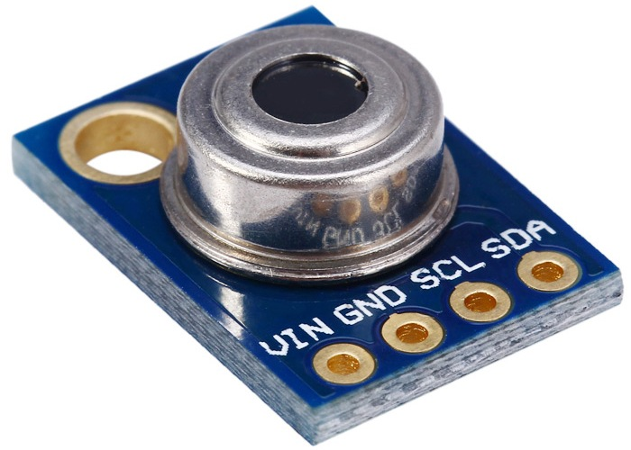

# MLX90614

makecode micro:bit extension for MLX90614 IR thermometer.

## Usage

Open [microbit makecode](https://makecode.microbit.org/#editor)  
Click on Advanced -> Extensions  
Paste this URL inside the search box and press enter:  
https://github.com/arduino12/microbit_mlx90614

## Enjoy!
A.E. Tech
